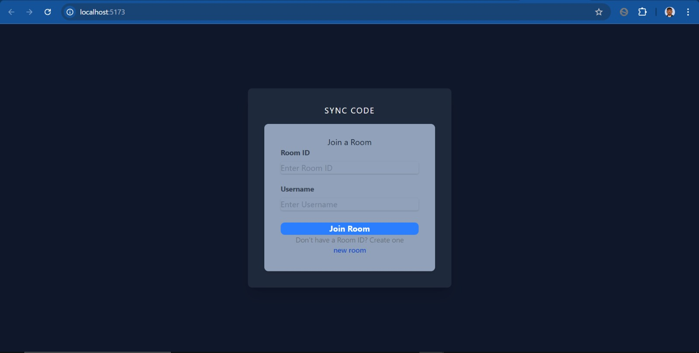
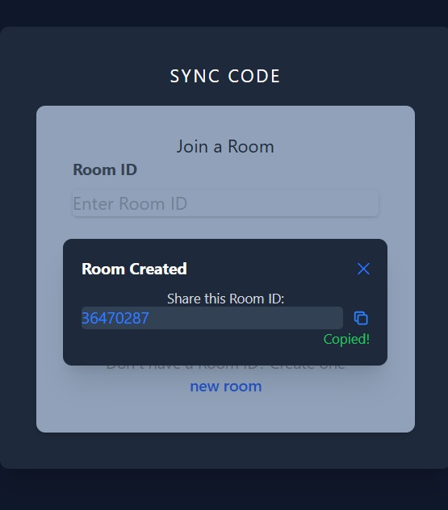

# Real Time Collaborative Code Editor

A real-time collaborative code editor built with a **React (Vite/TypeScript)** frontend and a **Python (FastAPI)** backend.

## Project Video
---

https://github.com/user-attachments/assets/a5292569-b45e-4dc2-800d-242b76a92472


### User Interface

| Join Room Screen | Room Id Generation |
| :---: | :---: |
|  |  |

## Prerequisites

Before you begin, ensure you have the following installed:
* [Node.js](https://nodejs.org/) (v16 or higher)
* [Python](https://www.python.org/) (v3.8 or higher)
* Git
## 🚀 Setup Instructions

To run this project, you will need to open **two separate terminals**: one for the backend server and one for the frontend client.
### 1\. Clone the Repository
```bash
git clone [https://github.com/Saswata777/Real-Time-Code-Editor.git](https://github.com/Saswata777/Real-Time-Code-Editor.git)
cd Real-Time-Code-Editor
```
### 2\. Backend Setup (Python)

1.  **Navigate to the project root** (if you aren't there already).

2.  **Create a virtual environment** (named `myenv`):

    ```bash
    python -m venv myenv
    ```

3.  **Activate the virtual environment**:

      * **Windows (PowerShell):**
        ```powershell
        .\myenv\Scripts\activate
        ```
      * **Mac/Linux:**
        ```bash
        source myenv/bin/activate
        ```

4.  **Install dependencies**:

    ```bash
    pip install -r backend/requirements.txt
    ```

5.  **Run the Server**:
    *(Make sure you are in the root folder)*

    #### Runs the FastAPI server
    ```bash
    uvicorn backend.app.main:app --reload
    ```

    *The server should now be running on `http://localhost:8000`.*

-----


### 3\. Frontend Setup (React + Vite)

Open your **second terminal** and follow these steps:

1.  **Navigate to the frontend folder**:

    ```bash
    cd frontend
    ```

2.  **Install Node dependencies**:

    ```bash
    npm install
    ```

3.  **Start the Development Server**:

    ```bash
    npm run dev
    ```

    *The frontend should now be running on `http://localhost:5173`.*

-----

## 📂 Project Structure

```text
REAL TIME CODE EDITOR/
├── backend/
│   ├── app/
│   │   ├── models/
│   │   │   ├── __init__.py
│   │   │   └── room_model.py
│   │   ├── routers/
│   │   │   ├── __init__.py
│   │   │   ├── autocomplete.py
│   │   │   └── rooms.py
│   │   ├── schemas/
│   │   │   ├── __init__.py
│   │   │   ├── autocomplete.py
│   │   │   └── room.py
│   │   ├── services/
│   │   │   ├── __init__.py
│   │   │   ├── db.py
│   │   │   └── room_manager.py
│   │   ├── __init__.py
│   │   └── main.py
│   └── requirements.txt
├── frontend/
│   ├── public/
│   ├── src/
│   │   ├── components/
│   │   │   ├── CodeEditor.tsx
│   │   │   ├── EditorPage.tsx
│   │   │   ├── JoinRoom.tsx
│   │   │   ├── LanguageSelector.tsx
│   │   │   ├── NewRoomPopover.tsx
│   │   │   ├── Output.tsx
│   │   │   └── Sidebar.tsx
│   │   ├── api.ts
│   │   ├── App.css
│   │   ├── App.tsx
│   │   ├── constants.ts
│   │   ├── index.css
│   │   ├── main.tsx
│   │   ├── theme.ts
│   │   └── ws.ts
│   ├── eslint.config.js
│   ├── index.html
│   ├── package.json
│   ├── tsconfig.json
│   └── vite.config.ts
└── .gitignore
```

## Architecture & Design Choices

### Backend Strategy (FastAPI + WebSockets)
* **Hybrid State Management**: The application uses a hybrid approach for handling room state. Active rooms are held in **memory** (Python dictionary) for ultra-low latency access during typing, while changes are asynchronously persisted to the **Database** (SQLite/PostgreSQL) for durability.
* **Concurrency Control**: Used `asyncio.Lock` in the `RoomManager` to ensure thread safety when multiple users modify room state simultaneously.
* **WebSocket Protocol**: Implemented a custom event-driven protocol (`INIT`, `CODE_UPDATE`, `CURSOR_MOVE`) to handle real-time synchronization efficiently.
* **Database Agnostic**: The `databases` library allows seamless switching between SQLite (for development) and PostgreSQL (for production) via environment variables.

### Frontend Strategy (React + Vite)
* **Vite**: Chosen for its fast HMR (Hot Module Replacement) and optimized build process.
* **WebSocket Management**: A dedicated WebSocket service handles connection lifecycles, ensuring automatic reconnection logic and clean disconnects.
* **Debouncing**: Implemented on the frontend to prevent flooding the backend with autocomplete requests while the user is still typing.
## API Endpoints

### HTTP Endpoints
| Method | Endpoint | Description |
| :--- | :--- | :--- |
| `POST` | `/rooms` | Creates a new room and returns the `room_id`. |
| `POST` | `/autocomplete` | Accepts code context and returns mock AI suggestions. |

### WebSocket Events
The WebSocket connection is established at `ws://localhost:8000/ws/{room_id}`.

| Event Type | Direction | Payload | Description |
| :--- | :--- | :--- | :--- |
| `INIT` | Server → Client | `{ code, language }` | Sent immediately upon connection. |
| `CODE_UPDATE` | Bidirectional | `{ code }` | Broadcasts code changes to all other clients. |
| `CURSOR_MOVE` | Bidirectional | `{ user, cursor }` | Syncs cursor position (mocked) to others. |

## Limitations

1.  **Conflict Resolution**: Currently uses a "Last-Write-Wins" approach. If two users type exactly at the same time on the same line, one change might overwrite the other.
2.  **Synchronization Latency**: Users may need to type at a moderate pace to see consistent results immediately. Extremely rapid typing can sometimes outpace the WebSocket broadcast loop, causing temporary visual "jumps" or cursor resets.
3.  **Scalability**: Room state is stored in-memory on a single server instance. This does not support horizontal scaling (multiple server instances) without adding a Pub/Sub layer (like Redis).
4.  **Mock AI**: The autocomplete is rule-based (mocked) and does not use a real LLM.
## Tech Stack

* **Frontend:** React, TypeScript, Vite, Chakra UI, Tailwind CSS
* **Backend:** Python, FastAPI, WebSockets
* **Database:** SQLite
